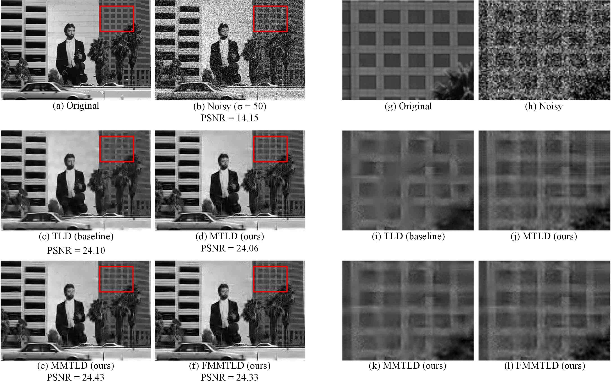
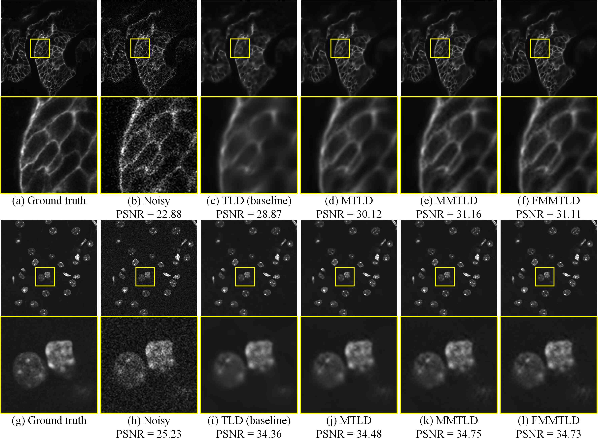

# Multiscale Sparsifying Transform Learning for Image Denoising

This repository contains the source code of the following paper:

Ashkan Abbasi, Amirhassan Monadjemi, Leyuan Fang, Hossein Rabbani, Neda Noormohammadi, "Multiscale Sparsifying Transform Learning for Image Denoising," [ArXiv Prepr.](https://arxiv.org/abs/2003.11265), 2020.

## Highlights

- Three strategies to exploit multiscale information in image denoising through the sparsifying transform learning denoising (TLD) [1-3] method are investigated.
- Wavelet subbands mixing is used as a cheap fusion technique to combine the results of single-scale and multiscale methods.
- We show that there is no need to denoise detail subbands and develop an efficient multiscale image denoising method. 
- Comprehensive experiments are carried out over two datasets:
  - 1) 20 classic test images corrupted with Gaussian noise
  - 2) Fluorescence microscopy images corrupted with real Poisson-Gaussian noise. 

## Sample Results 

Click on the figures to see the original high-resolution images. For more visual results, please refer to the paper.

**Gaussian Denoising**

**Poisson-Gaussian Denoising of Fluorescence Microscopy Images**

## Datasets

**(1)** 20 Classic test images which are stored [here](./DATASETS/20_classic_images).  

**(2)** Two additional images are used for only illustration purposes in Fig. 2 and Fig. 4 of the paper. These images are stored [here](./DATASETS/additional_images).

In our experiments, the above images are corrupted with synthetic white Gaussian noise. It is worth to mention that all of these images were downloaded from genuine sources to avoid reporting unfair results which are caused by using different versions of the same image.

**(3)** The `test_mix` subset of the Florescence Microscopy Denoising (FMD) dataset [4] ([GitHub page](https://github.com/yinhaoz/denoising-fluorescence), and [Download link](https://drive.google.com/drive/folders/1aygMzSDdoq63IqSk-ly8cMq0_owup8UM) (Google Drive)).

Florescence microscopy images are intrinsically corrupted with Poisson-Gaussian noise. 

## How to use the package

All of the codes run over a Windows operating system with a proper MATLAB installation. However, just  to let you know, we carried out our experiments using MATLAB R2019a over Windows 10. 

**Requirements:**

- Download the sparsifying transform learning [1-3] package (`TSP2015ClosedformTL_code.zip`) from [here](http://transformlearning.csl.illinois.edu/software/).
- Extract the package in the `METHODS` folder. So, the path should be like this: `./METHODS/TSP2015ClosedformTL_code`

 

### Experiment 1: Gaussian Denoising

#### Data preparation

Given a folder containing the images (e.g., `./DATASETS/20_classic_images`), you can use **`Generate_synthetic_Gaussian_noise.m`** to generate noisy version of those images. For each given noise level, this script saves the noisy image and original image in separate `.mat` files and place them into a subfolder. 

By storing noisy images in `.mat` files, we can ensure that our experiments are as repeatable as possible. 

Example:

Consider `cameraman.tif` image which is stored in `./DATASETS/20_classic_images`. We want to create three noisy versions from this image. Specifically, we want to add Gaussian noise with three levels which are in {15,25,50}. Then, the images are stored here: 

`./DATASETS/20_classic_images_matFiles/cameraman/sigma015`
`./DATASETS/20_classic_images_matFiles/cameraman/sigma025`
`./DATASETS/20_classic_images_matFiles/cameraman/sigma050`

In each subfolder, the noisy image is stored in `I1.mat`  and the clean one is stored in `I7.mat`.

#### Demos

`Demo_Gaussian_Denoising.m`: After preparing data, you can use this script to run TLD and its multiscale versions for denoising a given input image corrupted with synthetic white Gaussian noise. The script performs the following methods:

- TLD
- Multiscale TLD (MTLD)
- Mixed MTLD (MMTLD)
- Fast MMTLD (FMMTLD)

For more information, please refer to our paper.

 

### Experiment 2: Denoising Florescence Microscopy Images

In this section, we show that how you can use TLD and its multiscale versions for denoising florescence microscopy images. 

#### Data preparation

- Just download the `test_mix` subset from FMD dataset ([GitHub page](https://github.com/yinhaoz/denoising-fluorescence), and [Download link](https://drive.google.com/drive/folders/1aygMzSDdoq63IqSk-ly8cMq0_owup8UM) (Google Drive)).

- Put the `test_mix` folder into `./DATASETS/`.

The `test_mix` dataset contains 6 subfolders. For each ground-truth image, there are 5 noisy versions. The `raw` folder contains raw (real) noisy images which are directly obtained from microscopes. The other ones are noise reduced images which are obtained by averaging multiple images from the same field of view. For more information, refer to [4]

#### Demos

`Benchmark_TLD_for_FMDdataset.m`

The above script can be used to evaluate TLD and its multiscale versions for denoising fluorescence microscopy images. 

After preparing data, you can run this script over an image or all of the images in the `test_mix` dataset. It is required to set the indices of images which you want to perform the denoising methods over them. We set `which_images` variable to `[13]`. This causes to run the denoising methods over noisy versions of the 13-th ground-truth image. Set this variable to `1:48` if you want to run the methods over all images of `test_mix` dataset. All of the output images along with PSNR and SSIM values are saved into a `.MAT` file. The script also saves the output images with `tif` format in the `./RESULTS/test_mix` folder.

## References

[1] S. Ravishankar and Y. Bresler, “Learning Sparsifying Transforms,” IEEE Trans. Signal Process., vol. 61, no. 5, pp. 1072–1086, Mar. 2013.

[2] S. Ravishankar and Y. Bresler, “Learning Doubly Sparse Transforms for Images,” IEEE Trans. Image Process., vol. 22, no. 12, pp. 4598–4612, 2013.

[3] S. Ravishankar and Y. Bresler, “Sparsifying Transform Learning With Efficient Optimal Updates and Convergence Guarantees,” IEEE Trans. Signal Process., vol. 63, no. 9, pp. 2389–2404, May 2015.

[4] Y. Zhang et al., “A Poisson-Gaussian Denoising Dataset With Real Fluorescence Microscopy Images,” in IEEE Conference on Computer Vision and Pattern Recognition, 2019, pp. 11702–11710. 
